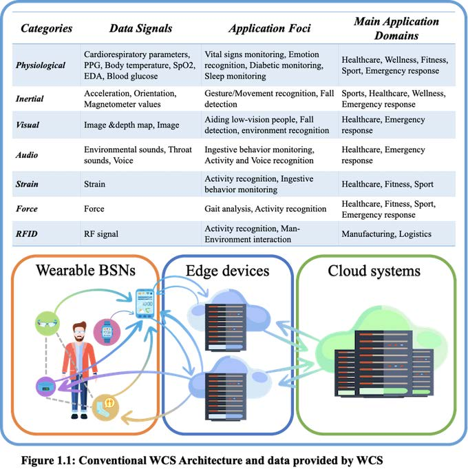

## [THE PROJECT](https://common-wears.github.io/2022/project/) &emsp; [STATE-OF-THE-ART](https://common-wears.github.io/2022/project/state-of-the-art/) &emsp; [APPROACH](https://common-wears.github.io/2022/project/approach/) &emsp; [USECASE](https://common-wears.github.io/2022/project/usecase/)   
 
Due to the new wave of wearable gadgetry hitting the ICT market, Wearable Computing Systems (WCS) are emerging as a new computing platform with full capabilities to support diversified application domains. Wearables, which include both devices and body sensors, are networked cyberphysical objects that may offer enough power to support local computation and sensor-based information as well as some actuation. State-of-the-art WCS are devised using mainly single-user-oriented and application-specific approaches, confining their exploitation in single-user monitoring platforms developed around a traditional three-tier device-edge-cloud architecture. Next-generation WCS will be community-oriented (hereafter CO-WCS), that is, based on collectives of wearables and for groups of users. CO-WCS can efficiently and effectively support communities for advanced activity/situation recognition and awareness, via distributed autonomic control and self-adaptive feedback loops. They are characterized by self-organization, self-adaptation and deployment independence. Existing approaches addressing systems with these features can be categorised as follows:  

  - Self-organisation: traditional mechanisms, paradigms, patterns and applications of self-organisation are heavily inspired by nature, whereas recent approaches aim at devising computational models enriching expressiveness and addressing by-design robustness. For instance, Codeblue introduced a wearable Body Sensor Networks (BSNs)-based framework for self-organization of collective wearables in health-care oriented emergency response scenarios; however, it was created using a scarcely-reusable application-specific approach.  
  - Self-adaptation: a common approach to realise self-adaptation is architecture-based, typically adopting frameworks like MAPE-K. In the context of BSNs, SPINE* introduced the concept of autonomic plane and exemplified it in human activity recognition tasks.   
  - Deployment independence: the goal is to consider system behaviour as a conceptually global computation performed on the whole set of system devices (this is known as macro-programming). In Osmotic computing authors suggest to deploy micro-services opportunistically on the edge-fog-cloud platform, whereas DR-BIP and DreAM use components, connectors, maps and deployments, to model and analyse dynamic architectures. Macro-programming in the context of BSNs was applied by SPINE2 using a task-oriented approach.   

Engineering trustworthy computational services over CO-WCS is challenging. Therefore, devising a rigorous methodology, supported by verification and simulation tools, is fundamental. A few methodologies in the area of IoT and WCS were introduced. Particularly, ACOSO-Meth and Prometheus could be customized to match some requirements of CO-WCS. Although SPINE-DM is the only available methodology for BSN systems, it is focuse t is focused on single-user WCS and not on CO-WCS. To overcome single-user-orientation, BodyCloud was introduced; however, it relies on cloud-based data collection, processing, analysis and decision-making.  

