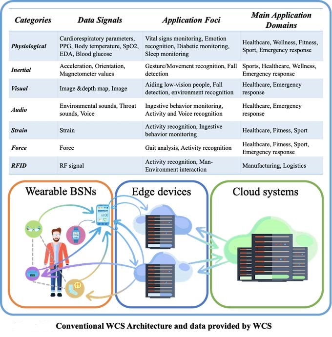

## [THE PROJECT](https://common-wears.github.io/2022/project/) &emsp; [STATE-OF-THE-ART](https://common-wears.github.io/2022/project/state-of-the-art/) &emsp; [APPROACH](https://common-wears.github.io/2022/project/approach/) &emsp; [USE CASES](https://common-wears.github.io/2022/project/usecase/)    
 
Due to the new wave of wearable gadgetry hitting the ICT market, Wearable Computing Systems (WCS) [1,2] are emerging as a new computing platform with full capabilities to support diversified application domains. Wearables, which include both devices and body sensors, are networked cyberphysical objects that may offer enough power to support local computation and sensor-based information as well as some actuation [3,4,5].  

State-of-the-art WCS are devised using mainly single-user-oriented and application-specific approaches, confining their exploitation in single-user monitoring platforms developed around a traditional three-tier device-edge-cloud architecture (see Figure below).  

Next-generation WCS will be community-oriented (hereafter CO-WCS), that is, based on collectives of wearables and for groups of users. CO-WCS can efficiently and effectively support communities for advanced activity/situation recognition and awareness, via distributed autonomic control and self-adaptive feedback loops. They are characterized by self-organization, self-adaptation and deployment independence. Existing approaches addressing systems with these features can be categorised as follows:  
  - Self-organisation: traditional mechanisms, paradigms, patterns and applications of self-organisation are heavily inspired by nature [6], whereas recent approaches aim at devising computational models enriching expressiveness and addressing by-design robustness [7]. For instance, Codeblue introduced a wearable Body Sensor Networks (BSNs)-based framework for self-organization of collective wearables in health-care oriented emergency response scenarios [8]; however, it was created using a scarcely-reusable application-specific approach.
  - Self-adaptation: a common approach to realise self-adaptation is architecture-based, typically adopting frameworks like MAPE-K [9]. In the context of BSNs, SPINE* [10] introduced the concept of autonomic plane and exemplified it in human activity recognition tasks.
  - Deployment independence: the goal is to consider system behaviour as a conceptually global computation performed on the whole set of system devices (this is known as macro-programming) [11]. In Osmotic computing [12] authors suggest to deploy micro-services opportunistically on the edge-fog-cloud platform, whereas DR-BIP [13] and DreAM [14] use components, connectors, maps and deployments, to model and analyse dynamic architectures. Macro-programming in the context of BSNs was applied by SPINE2 using a task-oriented approach [15].  

Engineering trustworthy computational services over CO-WCS is challenging. Therefore, devising a rigorous methodology, supported by verification and simulation tools, is fundamental. A few methodologies in the area of IoT and WCS were introduced [16]. Particularly, ACOSO-Meth [17] and Prometheus [18] could be customized to match some requirements of CO-WCS. Although SPINE-DM [19] is the only available methodology for BSN systems, it is focused on single-user WCS and not on CO-WCS. To overcome single-user-orientation, BodyCloud [20] was introduced; however, it relies on cloud-based data collection, processing, analysis and decision-making.  

CO-WCS need guarantees of properties. Therefore, formal methods and tools supporting validation of a system design against certain properties (such that these properties can be transferred to system execution) are necessary. Unfortunately, the complexity of CO-WCS deployments typically makes the problem intractable [21]. Distributed runtime verification [22] is emerging as a powerful tool for systems having the characteristics of CO-WCS. However, approaches to distributed runtime verification typically rely on simplifying assumptions such as absence of failures and mobility, which are typical properties of CO-WCS, and therefore need to be enhanced [23].  

As CO-WCS aim to support jointly-acting humans’ teams, multi-user activity recognition is another fundamental aspect of such systems in order to not only recognize group activities but also to check whether or not such activities are performed correctly. Multi-sensor fusion algorithms based on distributed learning to recognize group-oriented activities are discussed in [24]. However, the proposed methods are only able to detect simple activities (e.g., handshake, walking together) in well-defined contexts. In [25] collaborative BSNs were introduced through an extension of the well-known SPINE middleware to recognize simple collaborative tasks performed by co-located people.  

Finally, in order to effectively support CO-WCS from the device viewpoint, wearables should be also developed to be natively cooperative [26], being enriched with new multiple-user-oriented sensing, communication, and computing capabilities.

### Bibliography  

[1] https://www.gartner.com/en/newsroom/press-releases/2021-01-11-gartner-forecasts-global-spending-on-wearable-devices-to-total-81-5-billion-in-2021  
[2] M Zheng, PX Liu, R Gravina, G Fortino: An emerging wearable world: new gadgetry produces a rising tide of changes and challenges. IEEE SMC Mag, 4(4), 6-14, 2018  
[3] G-Z Yang (Ed.), Body Sensor Networks.Springer 2014  
[4] R Gravina, G Fortino: Wearable Body Sensor Networks: state-of-the-art and research directions. IEEE Sensors Journal,2021  
[5] G Fortino, R Gravina, S Galzarano: Wearable Computing: From Modeling to Implementation of Wearable Systems based on Body Sensor Networks.IEEE Press, 2018  
[6] G Di Marzo Serugendo et al: Self-Organisation: Paradigms and Applications. Engineering Self-Organising Systems 2003:1-19, Springer LNCS 2977  
[7] M Viroli, G Audrito, J Beal, F Damiani, D Pianini: Engineering Resilient Collective Adaptive Systems by Self-Stabilisation. ACM Trans. Model. Comput. Simul. 28(2): 16:1-16:28(2018)  
[8] D Malan et al.: CodeBlue: An ad hoc sensor network infrastructure for emergency medical care. In the Proc. of the Int. Work. on Wearable and Implantable Body Sensor Networks, London, 2004  
[9] JO Kephart, DM Chess: The Vision of Autonomic Computing. IEEE Comp. 36(1):41-50(2003)  
[10] G Fortino, S Galzarano, A Liotta: An autonomic plane for Wireless Body Sensor Networks. ICNC 2012: 94-98,2012  
[11] R Casadei, D Pianini, A Placuzzi, M Viroli, and D Weyns: Pulverization in Cyber-Physical Systems: Engineering the Self-Organizing Logic Separated from Deployment. Future Internet 2020, 12(11), 203  
[12] M Villari et al: Osmosis: The Osmotic Computing Platform for Microelements in the Cloud, Edge, and Internet of Things. IEEE Comp. 52(8):14-26(2019)  
[13] R El Ballouli et al. “DR-BIP - Programming Dynamic Reconfigurable Systems,” Verimag Research Rep. TR-2018-3,2018  
[14] R De Nicola, et al.(2018) DReAM: Dynamic Reconfigurable Architecture Modeling. Springer LNCS 11246  
[15] S Galzarano, R Giannantonio, A Liotta, G Fortino: A Task-Oriented Framework for Networked Wearable Computing. IEEE Trans Autom. Sci. Eng. 13(2):621-638(2016)  
[16] G Fortino, C Savaglio, G Spezzano, M Zhou, Internet of Things as System of Systems: A Review of Methodologies, Frameworks, Platforms, and Tools, IEEE Trans. Syst., Man, Cybern., Syst.,2021  
[17] G Fortino, W Russo, C Savaglio, W Shen, and M Zhou: Agent-oriented cooperative smart objects: From IoT system design to implementation. IEEE Trans. Syst., Man, Cybern., Syst., 48(11):1939–1956,2018  
[18] B Manate et al.: Applying the prometheus methodology for an Internet of Things architecture. in Proc. IEEE/ACM 7th Int. Conf. Utility Cloud Comput., London,2014  
[19] G Fortino, R Giannantonio, R Gravina, P Kuryloski, R Jafari: Enabling Effective Programming and Flexible Management of Efficient Body Sensor Network Applications. IEEE Trans. Hum. Mach. Syst. 43(1):115-133 (2013)  
[20] G Fortino, D Parisi, V Pirrone, G Di Fatta: BodyCloud: A SaaS approach for community Body Sensor Networks. Future Gener. Comput. Syst. 35:62-79 (2014)  
[21] A Bennaceur, et al. 2019: Modelling and analysing resilient cyber-physical systems, in IEEE/ACM 14th Int. Symp. on SEAMS  
[22] M Leucker, C Schallhart, 2009: A brief account of runtime verification. J. Log. Algebr. Program. 78(5):293-303 2009  
[23] A Francalanza, et al., 2018: Runtime verification for decentralised and distributed systems. In Springer LNCS 10457 pp.176-210  
[24] Q Li, R Gravina, Y Li, SH Alsamhi, F Sun, G Fortino: Multi-user activity recognition: Challenges and opportunities. Inf. Fusion 63:121-135 (2020)  
[25] G Fortino, S Galzarano, R Gravina, W Li: A framework for collaborative computing and multi-sensor data fusion in body sensor networks. Inf. Fusion 22:50-70 (2015)  
[26] MC Silva et al Field Research Cooperative Wearable Systems: Challenges in Requirements, Design and Validation. Sensors. 19(20):4417 (2019)  
