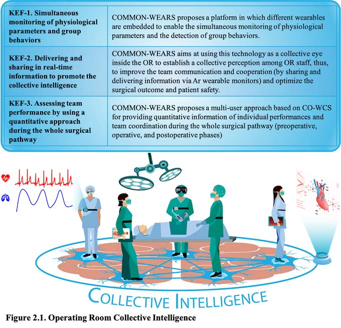
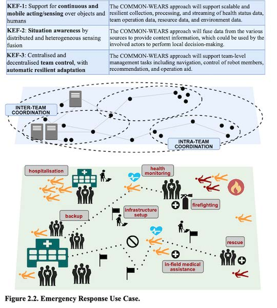
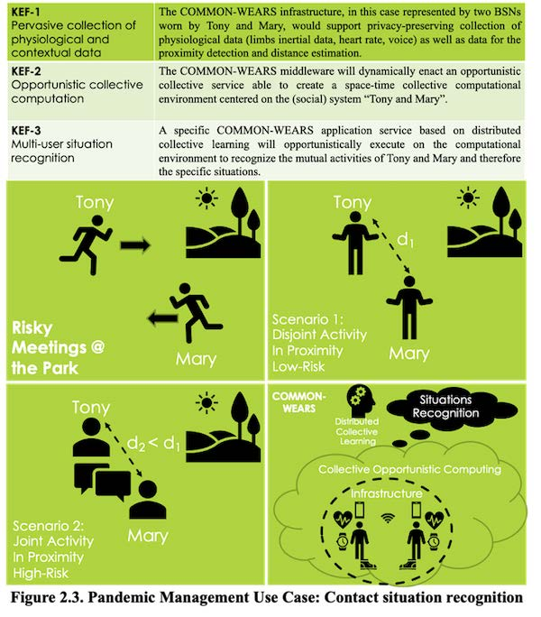

## Use Case 1. Operating Room Collective Intelligence  
The community engaged in this use case is the surgical team working in the Operating Room (OR). The OR is a complex and technology-rich environment in which an effective communication and coordination of the surgical team is crucial for safe and efficient functioning. The team members (e.g., surgeons, nurses, and anaesthetists) should adapt their own inputs and efforts to those of their teammates to accomplish shared goals, carry out planned tasks and handle unexpected events. This group ability, known as Collective Intelligence (CI), may positively impact on patient safety and surgical outcomes given the task and environment complexity. Although OR team performance is recognized as a factor to pursue good surgical care and good surgical outcomes, surprisingly, practical issues of developing quantitative and objective measurements in the OR need to be still solved. Thus, new methods for objective measurements to evaluate the team performance should be defined to support the CI. COMMON-WEARS aims at mapping and fostering the CI through a community-driven approach able to improve OR team performance through the connection among surgical team members. It proposes a strategy grounded on three main Key Enabling Features (KEF) to overcome the existing limitations.  

  

## Use Case 2. Mass Casualties Event Emergency Response  
Mass casualty events have become an increasingly important concern for the society due to several contexts ranging from the increasing risks of civilian-targeted terrorist activity to high risks of earthquakes in specific areas. Notably, a large number of casualties within a small area can overwhelm emergency field personnel and hospital staff. Without appropriate resource allocation and management, such situations can lead to far-reaching systems failures and a breakdown of the caregiving process. CO-WCS would provide key services to bridge the gap between patient load and available resources. When faced with a large number of casualties, the goal is to first care for those patients who will benefit the most from trauma care and rapid surgical intervention. To accomplish this, emergency teams can leverage wearable interconnected devices to operate as a collective, being guided by a remote control room or specific personnel in the field, and deploying wearables to monitor severely injured patients. Using wearables, triage in the field and triage at the hospital would become interactive by continuously feeding patient capacity information from the CO-WCS to a decision support system. CO-WCS would allow efficient matching of out-of-hospital caseload to critical, hospital-based trauma facilities and resources. For example, teams could be alerted to locate more quickly those victims who were initially physiologically stable, but who subsequently deteriorate. CO-WCS would track stable patients from triage, through treatment, to their final hospital destination, all the while conveying vital sign and location data to the host system. The KEF to overcome the existing limitations.

  

## Use Case 3. Pandemic Management  
Due to the COVID-19 pandemic, contact-tracing mobile applications have recently become a powerful tool to monitor social distance and reconstruct virus circulation in a community so as to promptly take countermeasures to limit the outbreak. However, current approaches only take into account GPS and/or Bluetooth to roughly assess proximity with the goal of detecting contacts among people. Instead, by coupling current proximity-based methods with contextual information about the individual and group activity, we could provide a better assessment of the actual risk of exposure than what would emerge from the simple fact of being in contact with an infected subject. CO-WCS provides the “ideal” platform not only to trace “contacts” more effectively and efficiently by specifically recognizing single-user and multi-user behaviors and situations in specific contexts but also by consequently providing real-time information feedback to people (e.g., how to behave or which countermeasures to take), leading to a more accurate management of the pandemic. As illustrated in Figure, while Tony and Mary are running in a park for fitness, they have a “contact”. To precisely assess how dangerous the contact may be, an important question raises: which kind of contact scenario is it in terms of virus transmission potential? If Tony and Mary would use currently available apps based on smartphones (or even bracelets), the contact-tracing management system could only estimate their mutual distance and for how long they have been in contact. Such information is too poor to provide strong insights on understanding the “contact” scenario as to estimate the risk of contagion. According to traditional systems, the two following scenarios are understood as identical: 1) Tony and Mary stop some meters apart, then start exercising for five minutes and then leave; and 2) Tony and Mary stop some meters apart and talk to each other without wearing any mask for 5 minutes. However, according to current COVID-19 studies, scenario 2 is much more dangerous than scenario 1. Thus, a system able to accurately recognize the 2 different situations may label scenario 2 as high-risk and scenario 1 as low-risk. COMMON-WEARS would allow a finer grained and more accurate recognition of many different critical situations, notably increasing the efficacy of a pandemic management system.

  
