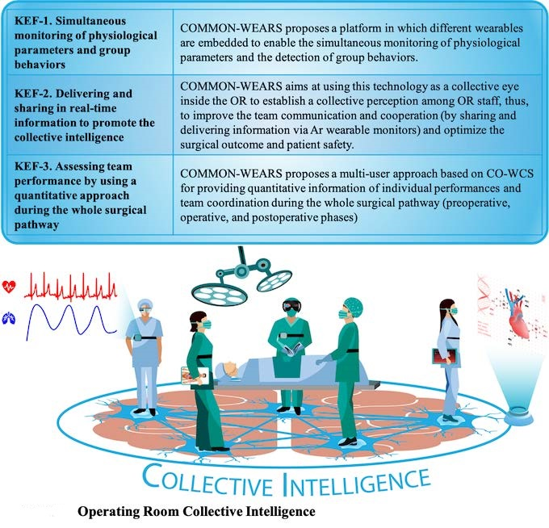
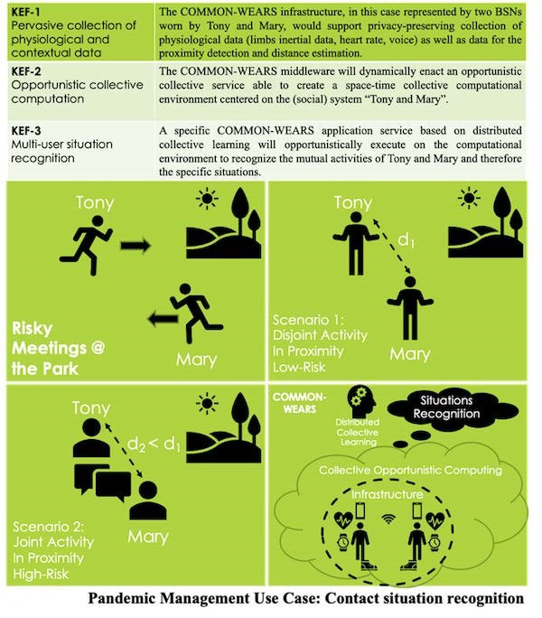

## [THE PROJECT](https://common-wears.github.io/2022/project/) &emsp; [STATE-OF-THE-ART](https://common-wears.github.io/2022/project/state-of-the-art/) &emsp; [APPROACH](https://common-wears.github.io/2022/project/approach/) &emsp; [USE CASES](https://common-wears.github.io/2022/project/usecase/)  

### Use Case 1. Operating Room Collective Intelligence  
The community engaged in this use case is the surgical team working in the Operating Room (OR). The OR is a complex and technology-rich environment in which the team members need to adapt their inputs to those of their teammates in order to achieve shared goals. This is known as Collective Intelligence (CI). This group ability may positively impact on patient safety and surgical outcomes. Although OR team performance is recognized as a factor to pursue good surgical care and good surgical outcomes, surprisingly, practical issues of developing quantitative and objective measurements in the OR need to be still solved. Thus, new methods for objective measurements to evaluate the team performance should be defined to support the CI. COMMON-WEARS aims to map and foster the CI through a community-driven approach that is able to improve OR team performance. 

  

### Use Case 2. Mass Casualties Event Emergency Response  
Mass casualty events are becoming an increasingly important concern for society, due to several contexts. These events can overwhelm emergency field personnel and hospital staff, leading to systems failures. CO-WCS would provide key services to bridge the gap between patient load and available resources, when faced with a large number of casualties. This would allow emergency teams to operate as a collective, being guided by a remote control room or specific personnel in the field. This would also allow for the deployment of wearables to monitor severely injured patients. Using wearables, triage in the field and triage at the hospital would become interactive. CO-WCS would allow efficient matching of out-of-hospital caseload to critical, hospital-based trauma facilities and resources.

  

### Use Case 3. Pandemic Management  
Due to the COVID-19 pandemic, contact-tracking mobile applications have recently become a powerful tool to monitor social distance and reconstruct virus circulation in a community. Current approaches only take into account GPS and/or Bluetooth to roughly assess proximity with the goal of detecting contacts among people. By coupling current proximity-based methods with contextual information about the individual and group activity, we could provide a better assessment of the actual risk of exposure than what would emerge from the simple fact of being in contact with an infected subject. CO-WCS provides the “ideal” platform not only to trace “contacts” more effectively and efficiently by specifically recognizing single-user and multi-user behaviors and situations in specific contexts but also by consequently providing real-time information feedback to people (e.g., how to behave or which countermeasures to take), leading to a more accurate management of the pandemic.

  
